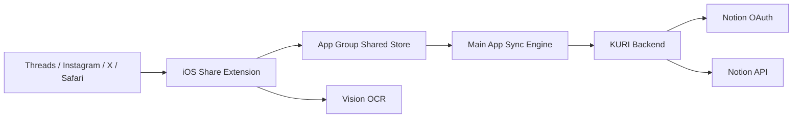

# KURI MVP 기술 설계서

## 1. 문서 목적

이 문서는 [KURI MVP PRD](/Users/yona/codes/kuri/docs/mvp-prd.md)를 구현 가능한 수준의 기술 설계로 확장한 문서다.

목표는 다음 세 가지다.

- iOS Share Extension 기반 저장 흐름을 안정적으로 구현한다.
- Notion 연결과 동기화를 MVP 범위 안에서 단순하게 유지한다.
- 저장 실패와 플랫폼 제약을 로컬 Outbox와 OCR fallback으로 흡수한다.

## 2. 범위와 전제

### 포함 범위

- iOS 앱 + Share Extension
- App Group 기반 로컬 저장소
- 이미지 OCR
- Notion OAuth
- Notion DB 자동 생성
- 저장 재시도 및 실패 복구

### 제외 범위

- 웹 클라이언트
- 멀티 디바이스 동기화
- 팀 단위 협업
- LLM 기반 요약/분류
- 고급 검색

### 핵심 전제

- MVP는 1인 사용자, 1개 Notion 워크스페이스 연결을 기본 단위로 본다.
- 저장 성공의 기준은 "Notion 반영 완료"가 아니라 "로컬 큐에 안전하게 기록됨"까지 포함한다.
- Share Extension은 빠르게 저장하고 종료해야 하므로, 무거운 네트워크 작업은 하지 않는다.
- OCR은 가능하면 extension 안에서 처리하되, 시간 초과 시 로컬에 보관 후 앱에서 후처리한다.

## 3. 설계 원칙

- 저장 우선: 공유 순간의 캡처 성공을 최우선으로 한다.
- 비동기 동기화: Notion 반영은 저장 이후 비동기로 처리한다.
- 중복 방지: 재시도와 네트워크 오류가 있어도 동일 아이템이 중복 생성되지 않도록 한다.
- 로컬 복구 가능성: 실패 원인과 재시도 상태를 로컬에 남긴다.
- 최소 서버: OAuth, 템플릿 생성, Notion 쓰기 프록시에만 서버를 사용한다.

## 4. 권장 아키텍처

PRD에서는 Notion API Proxy를 선택 사항으로 두었지만, MVP에서는 프록시를 사용하는 구성을 권장한다.

이유는 다음과 같다.

- Notion OAuth client secret을 앱에 둘 수 없다.
- 토큰 교환과 워크스페이스 연결 상태를 서버에서 관리해야 한다.
- 재시도 중 타임아웃이 발생했을 때 중복 페이지 생성을 서버에서 더 안전하게 막을 수 있다.
- 저장 실패 로그와 운영 지표 수집이 단순해진다.

## 5. 시스템 개요



## 6. 컴포넌트 설계

### 6.1 iOS Main App

역할:

- 첫 실행 온보딩
- Notion 연결
- 저장 내역 및 실패 항목 표시
- 백그라운드/포그라운드 동기화
- OCR 후처리

주요 화면:

- 온보딩 및 Notion 연결 화면
- 최근 저장 내역 화면
- 실패 항목 재시도 화면
- 설정 화면 (연결 해제, DB 재생성)

### 6.2 Share Extension

역할:

- 공유 payload 수집
- 태그/메모 입력 UI 제공
- 플랫폼 감지
- 이미지 저장 및 OCR 실행 시도
- 로컬 Outbox 적재
- Darwin notification 전송 (`com.yona.kuri.newCapture`) → Main app이 즉시 sync

제약:

- extension 내부에서는 네트워크 동기화를 수행하지 않는다.
- 저장 버튼 응답 시간은 1초 이내를 목표로 한다.
- OCR이 2.5초 안에 끝나지 않으면 `ocr_pending` 상태로 저장 후 종료한다.

### 6.3 Shared Store

App Group 컨테이너를 사용해 app과 extension이 동일한 로컬 데이터에 접근한다.

권장 구현:

- 저장소: SQLite
- 위치: App Group shared container
- 접근 계층: thin repository layer

SQLite를 권장하는 이유:

- Outbox와 재시도 큐를 명시적으로 다루기 쉽다.
- extension과 app 사이 상태 공유가 단순하다.
- 실패 원인, 재시도 시각, idempotency key 저장에 적합하다.

### 6.4 Sync Engine

Main app 내부의 동기화 워커다.

트리거:

- 앱 실행 직후
- 앱 foreground 진입 시 (scenePhase `.active`, 30초 throttle)
- Darwin notification 수신 시 (Share Extension 저장 후)
- Notion 연결 완료 직후
- 사용자의 수동 재시도 (pull-to-refresh)
- BGAppRefreshTaskRequest (15분 주기 자동 스케줄)

역할:

- `pending`, `failed`, `ocr_pending` 항목 조회
- OCR 후처리
- 백엔드 API 호출
- 성공/실패 상태 반영
- 다음 재시도 시각 계산
- 동기화 성공 후 로컬 이미지 삭제 (best-effort)

### 6.5 Backend

역할:

- Notion OAuth 시작/콜백 처리
- 설치 단위 세션 발급
- KURI 기본 DB 생성 또는 기존 DB 연결
- Notion 페이지 생성 프록시
- 동기화 idempotency 보장
- 실패 로그 저장

비포함:

- 일반 사용자 계정 시스템
- 웹 대시보드
- 복잡한 데이터 분석 파이프라인

## 7. 인증 및 세션 모델

MVP에서는 별도 회원 시스템 없이 설치 단위 인증을 사용한다.

### 방식

- 앱 첫 실행 시 `installation_id` UUID 생성 후 Keychain 저장
- Notion OAuth 시작 시 `installation_id`를 `state`에 서명해 포함
- OAuth callback 이후 backend가 해당 설치와 Notion workspace를 연결
- backend는 설치 단위 session token을 발급
- 앱은 session token을 Keychain에 저장하고 이후 sync 요청에 사용

### 장점

- Sign in with Apple 없이 MVP를 빠르게 만들 수 있다.
- 한 디바이스에서 개인 Notion 연결이라는 MVP 시나리오에 맞는다.

### 제한

- 앱 삭제/재설치 시 재연결이 필요할 수 있다.
- 멀티 디바이스 동기화는 추후 계정 시스템 도입이 필요하다.

## 8. 데이터 모델

### 8.1 로컬 도메인 모델

`CaptureItem`

| 필드 | 타입 | 설명 |
| --- | --- | --- |
| `id` | UUID | 클라이언트 생성 ID, idempotency key로도 사용 |
| `sourceApp` | string | `threads`, `instagram`, `x`, `safari`, `unknown` |
| `sourceUrl` | string? | 공유된 원본 URL |
| `sharedText` | text? | share sheet에서 넘어온 텍스트 |
| `memo` | text? | 사용자가 입력한 1줄 메모 |
| `tags` | string[] | 사용자 태그 |
| `ocrText` | text? | OCR 추출 텍스트 |
| `ocrStatus` | enum | `none`, `pending`, `completed`, `failed` |
| `imageLocalPath` | string? | App Group 내 이미지 경로 |
| `title` | string | Notion `Name`에 쓸 제목 |
| `status` | enum | `pending`, `syncing`, `synced`, `failed` |
| `retryCount` | int | 자동 재시도 횟수 |
| `nextRetryAt` | datetime? | 다음 자동 재시도 시각 |
| `lastErrorCode` | string? | 직전 오류 코드 |
| `lastErrorMessage` | text? | 사용자 표시용 오류 요약 |
| `notionPageId` | string? | 생성된 Notion 페이지 ID |
| `createdAt` | datetime | 생성 시각 |
| `updatedAt` | datetime | 수정 시각 |
| `syncedAt` | datetime? | 최종 성공 시각 |

### 8.2 제목 생성 규칙

`Name` 필드는 Notion DB 필수값이므로 항상 생성해야 한다.

우선순위:

1. 공유 텍스트 첫 줄
2. OCR 텍스트 첫 줄
3. URL hostname + 날짜

규칙:

- 80자 이내로 자른다.
- 앞뒤 공백, 연속 개행, 해시태그만 있는 문자열은 정리한다.
- 결과가 비어 있으면 `Saved on YYYY-MM-DD HH:mm` 형식을 사용한다.

### 8.3 최근 태그 저장

별도 `RecentTag` 테이블 또는 로컬 캐시를 둔다.

필드:

- `name`
- `lastUsedAt`
- `useCount`

표시 규칙:

- 최근 사용 순 상위 5개
- 동일 태그는 대소문자/공백 정규화 후 중복 제거

## 9. Notion 데이터베이스 설계

PRD의 필수 속성은 유지한다.

| 속성명 | 타입 | 매핑 |
| --- | --- | --- |
| `Name` | title | `CaptureItem.title` |
| `URL` | url | `sourceUrl` |
| `Platform` | select | `sourceApp` |
| `Tags` | multi-select | `tags` |
| `Memo` | rich text | `memo` |
| `Text` | rich text | `sharedText + ocrText` 정규화 결과 |
| `Status` | select | `Synced`, `Pending`, `Failed` |

### 권장 추가 속성

아래 속성은 MVP 필수는 아니지만 운영상 유용하다.

- `Captured At` (date)
- `Source Type` (select: Link / Image)
- `Client Item ID` (rich text)

### Status 필드 해석

중요한 점:

- 로컬에만 존재하는 `pending` 항목은 아직 Notion 페이지가 없을 수 있다.
- 따라서 Notion의 `Status`는 전체 시스템 상태의 source of truth가 아니다.
- 실제 동기화 상태의 기준은 로컬 Outbox다.

MVP 정책:

- 페이지 생성 성공 시 `Status=Synced`
- 서버가 페이지 생성 후 후속 작업에 실패한 경우에만 `Pending` 또는 `Failed`를 기록
- 페이지 생성 자체가 안 된 항목은 Notion DB에 나타나지 않는다

## 10. 플랫폼 인식 규칙

URL host 기반으로 1차 분류한다.

| host 패턴 | Platform |
| --- | --- |
| `threads.net` | `Threads` |
| `instagram.com` | `Instagram` |
| `x.com`, `twitter.com` | `X` |
| 그 외 브라우저 유입 URL | `Web` |
| URL 없음 | `Unknown` |

보조 규칙:

- 공유 텍스트에 앱 이름이 포함되면 host가 없을 때 fallback으로 사용
- 이미지 단독 공유는 직전 앱 컨텍스트를 신뢰하지 않고 `Unknown`으로 저장

## 11. 저장 및 동기화 플로우

### 11.1 첫 연결 플로우

1. 사용자가 앱에서 Notion 연결 버튼 선택
2. 앱이 backend의 OAuth 시작 endpoint 호출
3. SafariViewController 또는 시스템 브라우저에서 Notion 인증
4. backend callback에서 토큰 교환 및 workspace 식별
5. backend가 KURI DB를 찾거나 새로 생성
6. backend가 session token과 `databaseId`를 앱에 반환
7. 앱이 Keychain에 세션 저장

실패 처리:

- OAuth 취소 시 연결 상태는 `disconnected`
- DB 생성 실패 시 재시도 버튼 제공
- 권한 부족 시 Notion 재승인 유도

### 11.2 링크 저장 플로우

1. 사용자가 소셜 앱에서 Share Sheet 실행
2. Share Extension이 URL, 텍스트, 이미지 첨부 여부 수집
3. 사용자가 태그와 메모 입력
4. extension이 `CaptureItem` 생성 후 shared store에 즉시 저장
5. 사용자에게 "Saved locally" 상태를 표시하고 extension 종료
6. main app sync engine이 backend로 동기화
7. backend가 idempotency 확인 후 Notion 페이지 생성
8. 성공 시 로컬 상태를 `synced`로 갱신

### 11.3 이미지 + OCR 플로우

1. 이미지가 공유되면 extension이 shared container에 원본 저장
2. 즉시 downscale 및 OCR 시도
3. 2.5초 내 완료 시 `ocrText` 저장
4. 시간 초과 또는 오류 시 `ocrStatus=pending`으로 저장
5. main app이 후속 OCR 수행 후 sync 재시도

### 11.4 재시도 플로우

자동 재시도는 최대 3회다.

권장 간격:

1. 즉시 또는 15초 이내
2. 2분 후
3. 15분 후

이후 상태:

- `failed`로 전환
- 사용자가 수동 재시도 가능
- 오류 원인을 사용자 친화 문구로 표시

## 12. OCR 설계

### 처리 방식

- Apple Vision Framework 사용
- 언어 우선순위: 한국어, 영어
- 입력 이미지는 장변 2048px 이하로 정규화

### 출력 규칙

- 블록 간 개행 유지
- 과도한 공백 제거
- 10,000자 이상이면 잘라내고 말줄임 표시

### 실패 정책

- OCR 실패 자체는 저장 실패로 취급하지 않는다.
- OCR 실패 시에도 URL, 메모, 태그는 정상 저장한다.
- 이미지 기반 저장은 `Text` 없이도 sync 가능해야 한다.

## 13. Backend API 계약

### 13.1 `POST /v1/oauth/notion/start`

목적:

- OAuth 시작 URL 발급

요청 예시:

```json
{
  "installationId": "uuid"
}
```

응답 예시:

```json
{
  "authorizeUrl": "https://api.notion.com/..."
}
```

### 13.2 `GET /v1/oauth/notion/callback`

목적:

- OAuth code 교환
- workspace 연결
- 기본 DB bootstrap

callback 이후 앱으로 deep link:

```text
kuri://oauth/notion?status=success
```

### 13.3 `POST /v1/workspaces/bootstrap`

목적:

- KURI DB 존재 확인
- 없으면 생성
- template schema 보정

응답:

- `databaseId`
- `workspaceName`
- `connectionStatus`

### 13.4 `POST /v1/captures/sync`

목적:

- 캡처 1건을 Notion에 반영
- 동일 `clientItemId`로 중복 생성 방지

요청 예시:

```json
{
  "clientItemId": "8d7d1f3d-0a85-46ee-baf2-3a4d45d5f159",
  "databaseId": "notion-db-id",
  "title": "AI PM이 써둔 좋은 스레드",
  "sourceUrl": "https://threads.net/...",
  "platform": "Threads",
  "tags": ["pm", "ai"],
  "memo": "온보딩 카피 참고",
  "text": "정규화된 공유 텍스트 또는 OCR 텍스트",
  "status": "Synced",
  "capturedAt": "2026-03-02T13:00:00Z"
}
```

응답 예시:

```json
{
  "result": "created",
  "notionPageId": "page-id"
}
```

가능한 `result`:

- `created`
- `duplicate`
- `updated`

## 14. Idempotency 및 중복 방지

중복 생성은 UX를 크게 해치므로 MVP에서 반드시 막아야 한다.

정책:

- 클라이언트가 생성한 `CaptureItem.id`를 영구 idempotency key로 사용
- backend는 `clientItemId`와 `notionPageId` 매핑을 저장
- 동일 키 재요청 시 기존 page ID를 반환

추가 방어:

- 같은 URL + 같은 생성 시각 구간(예: 10초 이내) 중복 저장 시 로컬 경고 표시 가능
- 단, 서로 다른 메모/태그를 가진 저장은 강제 병합하지 않는다

## 15. 로컬 저장소 스키마

권장 테이블:

### `capture_items`

- `id` TEXT PRIMARY KEY
- `source_app` TEXT NOT NULL
- `source_url` TEXT
- `shared_text` TEXT
- `memo` TEXT
- `tags_json` TEXT NOT NULL
- `ocr_text` TEXT
- `ocr_status` TEXT NOT NULL
- `image_local_path` TEXT
- `title` TEXT NOT NULL
- `status` TEXT NOT NULL
- `retry_count` INTEGER NOT NULL DEFAULT 0
- `next_retry_at` TEXT
- `last_error_code` TEXT
- `last_error_message` TEXT
- `notion_page_id` TEXT
- `created_at` TEXT NOT NULL
- `updated_at` TEXT NOT NULL
- `synced_at` TEXT

### `recent_tags`

- `name` TEXT PRIMARY KEY
- `last_used_at` TEXT NOT NULL
- `use_count` INTEGER NOT NULL DEFAULT 1

### `app_state`

- `key` TEXT PRIMARY KEY
- `value` TEXT NOT NULL

용도:

- `database_id`
- `connection_status`
- `last_sync_at`

## 16. 오류 처리 정책

| 상황 | 사용자 표시 | 시스템 동작 |
| --- | --- | --- |
| 오프라인 저장 | 저장됨, 나중에 동기화됨 | 로컬 `pending` 적재 |
| Notion 미연결 | 저장됨, 연결 후 동기화 필요 | Outbox 유지 |
| API 타임아웃 | 동기화 지연됨 | 자동 재시도 |
| OAuth 만료/권한 오류 | Notion 재연결 필요 | 자동 재시도 중단 |
| OCR 실패 | 텍스트 추출 실패 | 원본 메모/태그만 저장 |
| DB schema 불일치 | 연결 설정 복구 필요 | bootstrap 재실행 |

오류 메시지 원칙:

- 내부 오류 문자열을 그대로 노출하지 않는다.
- 사용자는 행동 가능한 문구만 본다.
- 개발용 상세 오류는 로컬 로그/서버 로그에만 남긴다.

## 17. 보안 및 개인정보

### 저장 위치

- session token: Keychain
- installation ID: Keychain
- 로컬 Outbox/이미지: App Group container

### 서버 보안

- Notion 토큰은 서버에서 암호화 저장
- 모든 sync 요청은 session token 인증 필요
- 로그에는 원문 텍스트 전체를 남기지 않고 길이/플랫폼/오류 코드 중심으로 남긴다

### 개인정보 최소화

- OCR은 on-device 처리
- 이미지 원본은 sync 성공 후 삭제 가능 정책을 둔다
- 사용자가 실패 항목을 수동 삭제할 수 있어야 한다

## 18. 운영 지표

MVP에서 최소 수집해야 할 이벤트:

- `share_extension_opened`
- `capture_saved_locally`
- `capture_sync_started`
- `capture_sync_succeeded`
- `capture_sync_failed`
- `ocr_started`
- `ocr_succeeded`
- `ocr_failed`
- `notion_oauth_started`
- `notion_oauth_succeeded`
- `notion_oauth_failed`

핵심 집계 지표:

- 첫 저장 완료율
- 로컬 저장 성공률
- 최종 sync 성공률
- 평균 sync 완료 시간
- OCR 성공률
- 태그 입력률
- 실패 후 수동 재시도 성공률

## 19. 테스트 전략

### 단위 테스트

- 플랫폼 감지
- 제목 생성
- 태그 정규화
- 재시도 스케줄 계산
- OCR 텍스트 정규화

### 통합 테스트

- Share Extension -> Shared Store 저장
- Main App -> Backend sync
- OAuth 완료 후 bootstrap
- 동일 item 재전송 시 duplicate 처리

### 수동 QA 시나리오

- Threads 링크 공유
- Instagram 링크 공유
- X 링크 공유
- Safari 페이지 공유
- 이미지 단독 공유
- 오프라인 저장 후 온라인 복구
- Notion 연결 전 저장 후 나중에 연결
- 실패 항목 수동 재시도

## 20. 구현 우선순위

### Phase 1

- 로컬 저장소
- Share Extension 저장 UI
- 태그/메모 입력
- 플랫폼 감지

### Phase 2

- Notion OAuth
- DB bootstrap
- 기본 sync engine
- 상태 표시

### Phase 3

- OCR
- 자동 재시도
- 실패 리스트 및 수동 재시도
- 운영 로그

## 21. 오픈 이슈

MVP 착수 전에 아래 항목은 결정이 필요하다.

1. 이미지 원본을 Notion에도 첨부할지, OCR 텍스트만 저장할지
2. backend를 서버리스로 둘지, 장기 실행 가능한 API 서버로 둘지
3. iOS 최소 지원 버전을 어디까지 둘지
4. Notion DB를 항상 새로 만들지, 기존 DB를 선택 연결할지도 허용할지

## 22. 최종 권장안

현재 PRD 기준으로 가장 현실적인 MVP 구현안은 다음과 같다.

- iOS app + Share Extension
- App Group + SQLite 기반 Outbox
- 설치 단위 인증 + 최소 backend
- backend를 통한 Notion OAuth 및 page 생성
- OCR은 on-device, 실패해도 저장 자체는 성공 처리
- "저장됨"과 "Notion 동기화 완료"를 UX에서 명확히 분리

이 구성이 PRD의 핵심 목표인 빠른 저장, 높은 체감 성공률, 낮은 Notion 연결 이탈을 가장 적은 복잡도로 달성한다.
